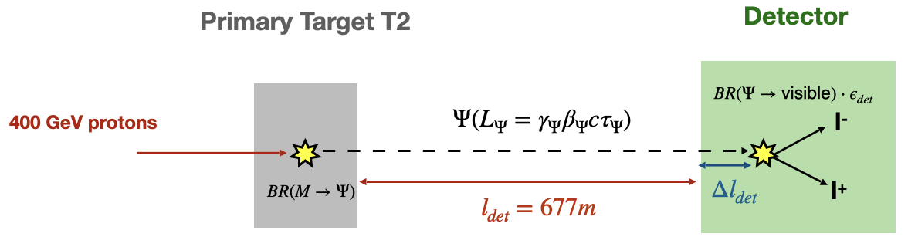

# ProtoDUNE-BSM Data Processing Tools

This document provides an outline of the data processing tools developed or employed for the ProtoDUNE-BSM project, focusing on the tools used within the DAQ and LArSoft frameworks. These tools are designed to assist in data filtering, waveform and trigger primitive event visualization and track recontruction, enhancing the analysis and interpretation of experimental data.

<figcaption align = "left">Figure 1: SPS proton interaction with Be T2 target to generate light mesons, decaying to long-lived particles. These particles would interact downstream in the liquid argon detector, producing visible signals.</figcaption>

At this moment, tools are devoted to finding interactions of neutrinos generated upstream in the T2 target and TAX in the ProtoDUNE-HD detector, also known as NP-04 module, located in the neutrino platform at CERN.

## Table of contents

1. [DAQ framework](#daq-framework)
2. [LArSoft framework](#larsoft-framework)
3. [Contributing](#contributing)
4. [License](#license)
5. [Acknowledgements](#acknowledgements)
6. [Contact](#contact)
7. [References](#references)

## DAQ framework

One of the major developments in the ProtoDUNE-BSM project is the implementation of a set of tools within the DAQ framework to facilitate data processing and event visualization. These tools are designed to streamline the analysis of raw data files, enabling researchers to extract relevant information and identify interesting events for further study.

More information about the setup, tools and their usage can be found in the [README_evd.md](README_evd.md) file.

## LArSoft framework

Up to Ciaran.

## Contributing

Instructions for how others can contribute to the project.

## License

Information about the project's license.

## Acknowledgements

Acknowledgements of contributors, libraries, and other resources used in the project.
<!-- DAQ framework -->
<!-- Thanks to DUNE-DAQ collaboration, especially to Wesley Ketchum, Alejandro Oranday, Michal Rigan, Artur Sztuc. -->

<!-- LArSoft framework -->
<!-- Mention each relevant contribution done. E.g., Henry Sieber the beamline simulation, Josu Hernández with neutrino fluxes... -->

## Contact

Contact information for the project maintainers.

## References

1. Link to ProtoDUNE-BSM GitHub repository [ProtoDUNE-BSM](https://github.com/ProtoDUNE-BSM)
2. Link to DAQ GitHub organization [DUNE-DAQ](https://github.com/DUNE-DAQ)
3. Link to DUNE GitHub organization [DUNE](https://github.com/DUNE)
4. Link to LArSoft GitHub organization [LArSoft](https://github.com/LArSoft)
5. Link to LArSoft collaboration [LArSoft collaboration](https://larsoft.org/)
